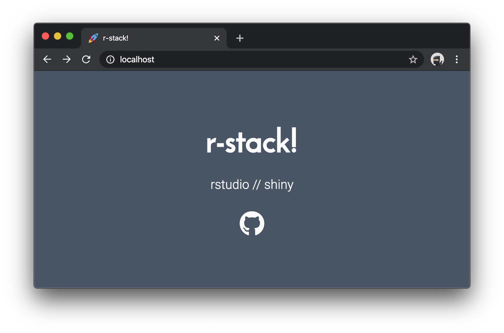

# r-stack



Run RStudio Server, Shiny Server and NGINX services with docker compose:

```bash
docker-compose up
```

**Note:** I have little experience with RStudio Server, Shiny Server, NGINX and Docker. This is a demonstration, use at your own risk! Feedback is welcome. Please submit an issue or PR if you'd like.

## Acknowledgements

* [`dev-landing-page`](https://github.com/flexdinesh/dev-landing-page)
* [`encrypted_dashboard`](https://github.com/mikkelkrogsholm/encrypted_dashboard)